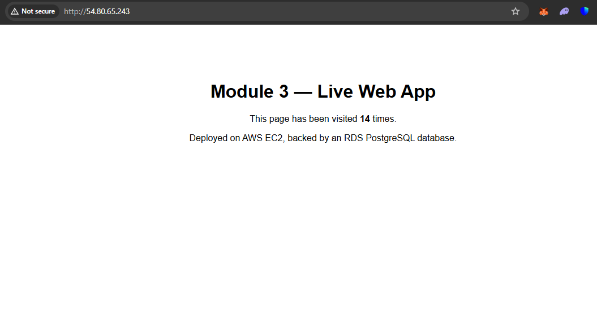
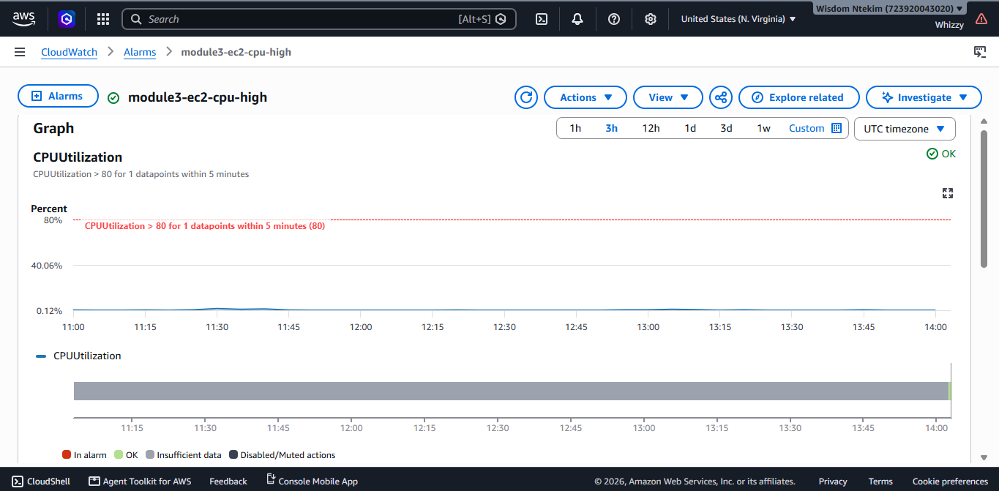

# Cloud Services & Web App Deployment — Module 3

A Flask web app, deployed on AWS EC2, backed by a managed RDS PostgreSQL database, served through nginx.

**Flow:** Application Code → Cloud Compute → Database/Storage → Networking → Live Web Application

**Live site:** http://54.80.65.243

---

## Service Exploration Notes

| Category | Service Used | What I Found |
|---|---|---|
| Compute | EC2 (reused from Module 2) | Chose EC2 over Lambda/Beanstalk since the Module 2 instance was already provisioned and secured |
| Object Storage | S3 | Created a test bucket, explored Standard vs. Infrequent Access storage classes — not integrated into the app itself. |
| Managed Database | RDS (PostgreSQL) | db.t3.micro, allocated storage (20 GiB), and single-AZ, since that's what Free Tier uses. |
| Virtual Networking | VPC / Subnets | This was automatically created after EC2 setup |
| IAM | IAM Role attached to EC2 | 'AmazonS3ReadOnlyAccess' was created and attached |
| Monitoring | CloudWatch | CPUUtilization alarm, threshold >80% over 5 minutes, on the EC2 instance |

**Compute choice reasoning:** EC2 was reused rather than provisioning Lambda or Elastic Beanstalk, since the Module 2 instance is already configured, secured, and running nginx — avoids duplicate infrastructure for a small app like this. (Lambda would suit a stateless/event-driven API better; Beanstalk trades control for convenience — noted in Module 1's IaaS/PaaS comparison.)

---

## Secure Configuration Management

- **Secrets:** Database credentials are never hardcoded or committed to git. They live in `/etc/webapp.env` on the server (outside the repo), loaded into the app via systemd's `EnvironmentFile` directive. `.env` is listed in `.gitignore`.
- **Production upgrade path:** for a real production system, these would move to **AWS Secrets Manager** or **Systems Manager Parameter Store** (SecureString), pulled at runtime via the IAM role rather than sitting in a flat file — noted here as the next step beyond this exercise.
- **Logging:** app output goes to systemd's journal (`journalctl -u webapp`), which is the standard place to look for errors without needing separate log file management.
- **Resource quotas:** RDS free tier caps at 20 GB storage; EC2 free tier is 750 hrs/month on t2/t3.micro. Both are visible in the Billing dashboard, and the CloudWatch alarm set in Module 1 covers unexpected spend.

---

## Deployment Log

### 1. Application code
See `app.py` — a minimal Flask app with a `/` route (DB-backed visit counter) and a `/health` check endpoint.

### 2. Cloud compute
Reused the EC2 instance from Module 2 (already hardened: key-only SSH, ufw, security group scoped to my IP).

### 3. Database/Storage
```bash
# RDS PostgreSQL, free tier
# Security group: inbound 5432 allowed ONLY from the EC2 instance's security group
psql -h database-1.cyz66uugiq1w.us-east-1.rds.amazonaws.com -U webapp_admin -d webapp -f schema.sql
```

### 4. App deployment on the server
```bash
sudo apt install python3-venv -y
mkdir ~/webapp && cd ~/webapp
python3 -m venv venv
source venv/bin/activate
pip install -r requirements.txt

# Create /etc/webapp.env (root-owned, not in the repo) with real DB credentials
sudo nano /etc/webapp.env
sudo chmod 600 /etc/webapp.env

# Install and start the service
sudo cp webapp.service /etc/systemd/system/
sudo systemctl daemon-reload
sudo systemctl enable webapp
sudo systemctl start webapp
sudo systemctl status webapp
```

### 5. Networking — nginx reverse proxy
Add to `/etc/nginx/sites-available/default`, inside the existing `server` block:
```nginx
location / {
    proxy_pass http://127.0.0.1:5000;
    proxy_set_header Host $host;
    proxy_set_header X-Real-IP $remote_addr;
}
```
Then:
```bash
sudo nginx -t
sudo systemctl reload nginx
```

### 6. Verification
```bash
curl http://localhost:5000/health      # app itself
curl http://54.80.65.243               # through nginx
curl http://54.80.65.243               # again — count should increment
```

## Result

markdown 
markdown 

---

## File Structure
```
.
├── app.py              # Flask application
├── requirements.txt    # Python dependencies
├── schema.sql          # Database schema
├── webapp.service       # systemd unit file
├── .env.example         # documents required env vars (no real secrets)
├── .gitignore
└── README.md
```

---

## Key Learnings
- A managed database (RDS) removes patching/backup overhead compared to running Postgres on the EC2 instance directly — the tradeoff is less low-level control.
- Locking the RDS security group to only the app server's security group (rather than a public endpoint) is the single most important networking decision in this stack.
- Loading secrets via a systemd `EnvironmentFile` outside the repo is a reasonable baseline; Secrets Manager/Parameter Store is the next step for anything beyond a learning project.
