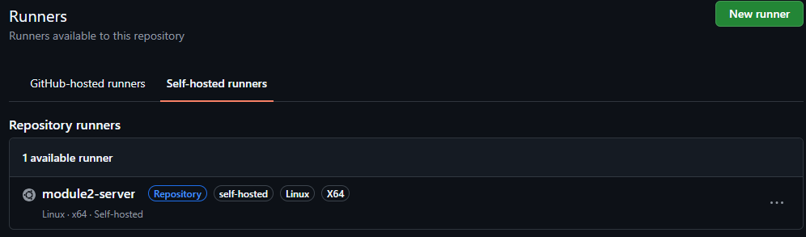
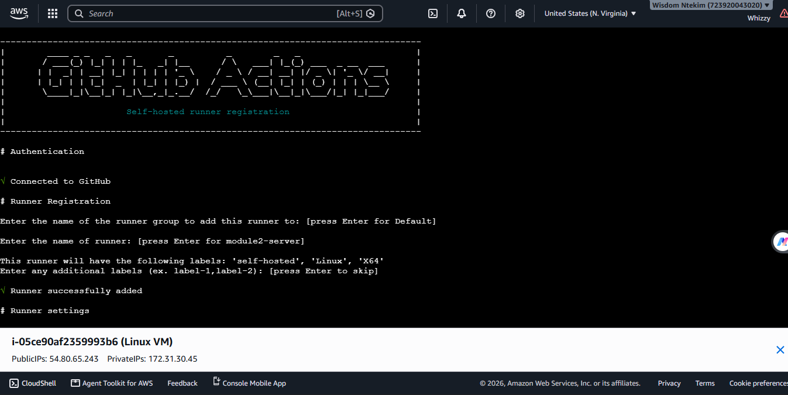
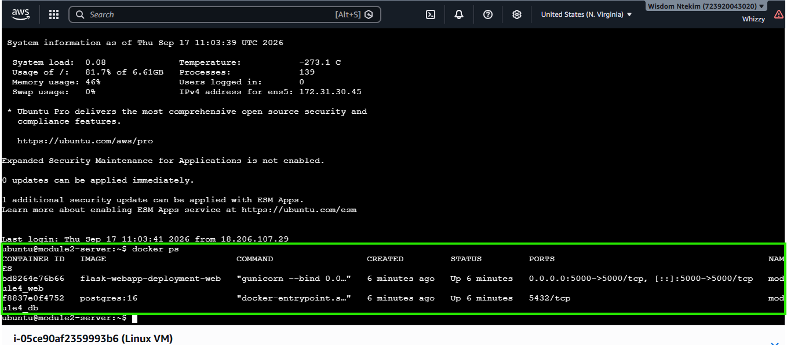
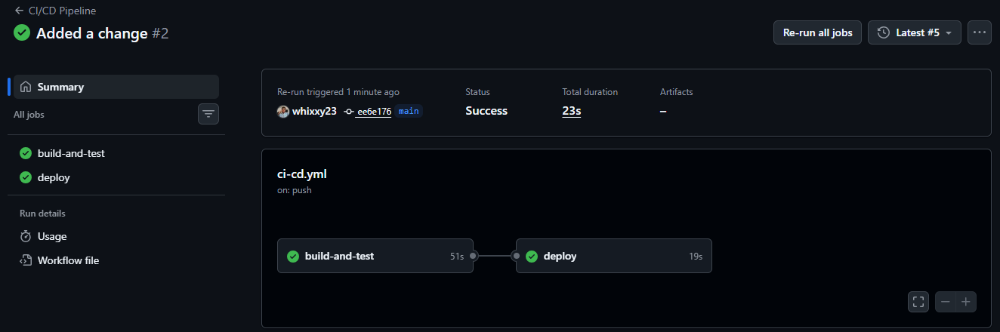
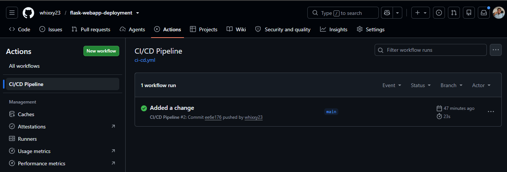

## CI/CD Pipeline — Module 5

**Flow:** GitHub → Build → Test → Docker → Deploy → Monitor

### DevOps concepts applied
- **Continuous Integration (CI):** every push/PR to `main` automatically runs tests and validates the Docker build — catching breakage before it reaches the server, not after.
- **Continuous Deployment (CD):** a passing build on `main` automatically deploys, with no manual server login required.
- **Trunk-based workflow:** all changes land on `main`; the pipeline itself is the gate, not a separate release branch.

### Why a self-hosted runner instead of SSH deploy
The EC2 security group's SSH rule is scoped to my own IP (from Module 2). A GitHub-hosted runner deploying via SSH would need either a broader inbound rule or a dynamic IP-allowlisting step — both add attack surface or complexity.

Instead, the EC2 instance runs as a **self-hosted GitHub Actions runner**. It makes an *outbound* connection to GitHub to pick up jobs, so no inbound firewall change was needed at all — the Module 2 hardening stays exactly as it was.

### Pipeline stages
1. **Build & Test** (GitHub-hosted runner) — installs dependencies, spins up a real Postgres service container, loads the schema, runs `pytest`, and validates `docker build` succeeds.
2. **Deploy** (self-hosted runner, only on `main`) — runs `docker compose up -d --build` directly on the EC2 instance using the just-pushed code.
3. **Monitor** — a post-deploy `curl` against `/health` fails the pipeline if the app didn't come back up correctly; container logs are dumped into the workflow run regardless of outcome (`if: always()`), giving basic observability without a separate monitoring stack.

### Environment management
- Test environment: Postgres service container with throwaway credentials, defined inline in the workflow — isolated from production.
- Production environment: `DB_USER`/`DB_PASSWORD` stored as GitHub Actions secrets, injected into `docker compose up` at deploy time — never written to any file in the repo.

## Results/Screenshots

**Self-hosted runner registered and online**

**Runner service running on EC2**

**Containers running on EC2 after deploy**

**Pipeline stages passing**

**Full workflow run, green end to end**

