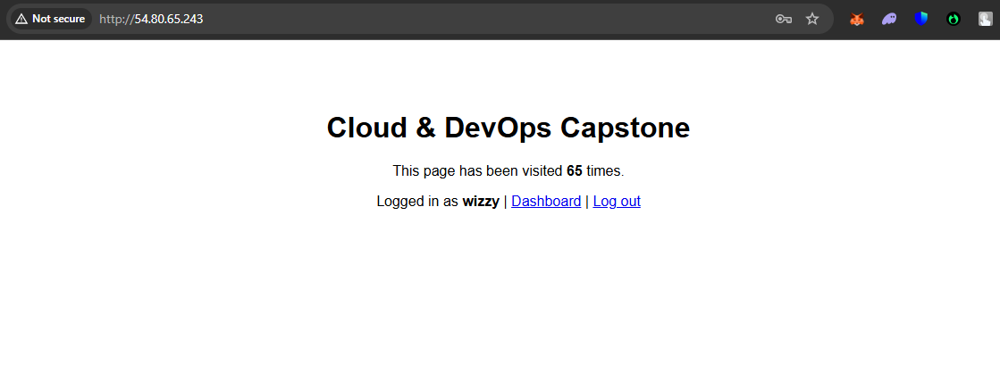
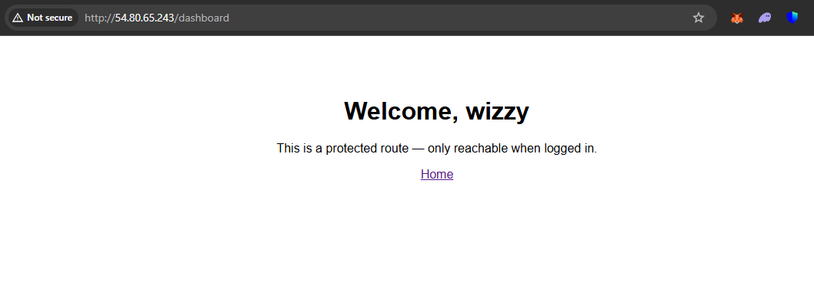
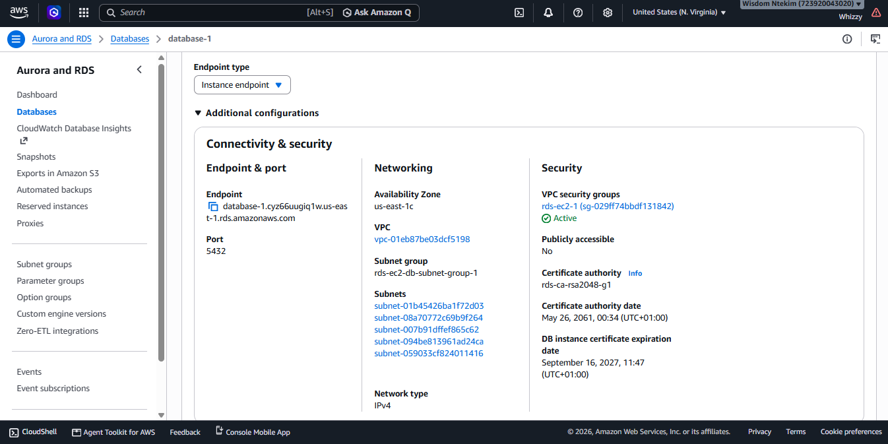
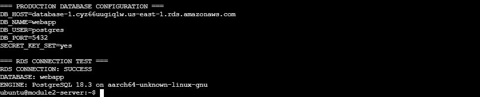
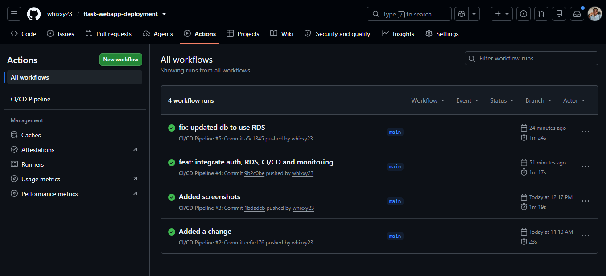
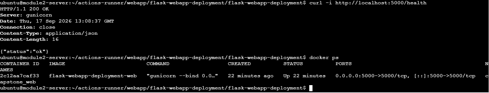

# Cloud & DevOps Capstone

A Flask web application deployed on AWS with Docker, GitHub Actions, Nginx, and Amazon RDS PostgreSQL.

This capstone brings together the cloud, containerization, CI/CD, authentication, and monitoring work completed throughout the previous modules.

---

## 🚀 Project Overview

The application includes:

* User registration and login
* Secure password hashing
* Session-based authentication
* Protected dashboard
* PostgreSQL database
* Docker containerization
* AWS EC2 deployment
* Amazon RDS PostgreSQL
* Nginx reverse proxy
* Automated CI/CD with GitHub Actions
* Application health checks
* Cloud monitoring

---

## 🏗️ Architecture

```text
                    Internet
                       │
                       ▼
                    Nginx
                       │
                       ▼
              Flask Docker Container
                       │
                       │ PostgreSQL
                       ▼
                Amazon RDS
                PostgreSQL


GitHub
   │
   ▼
GitHub Actions
   │
   ├── Test
   ├── Build Docker Image
   └── Deploy
          │
          ▼
     EC2 Self-hosted
        Runner
```

**Production database:** Amazon RDS PostgreSQL
**Application runtime:** Docker container on EC2

---

## ⚙️ Technology Stack

| Area               | Technology              |
| ------------------ | ----------------------- |
| Application        | Flask / Python          |
| Database           | PostgreSQL              |
| Cloud              | AWS                     |
| Compute            | EC2                     |
| Database Hosting   | Amazon RDS              |
| Web Server         | Nginx                   |
| Application Server | Gunicorn                |
| Containerization   | Docker / Docker Compose |
| CI/CD              | GitHub Actions          |
| Monitoring         | CloudWatch              |
| Version Control    | Git / GitHub            |

---

## 🔄 CI/CD Pipeline

```text
Git Push
   ↓
GitHub Actions
   ↓
Install Dependencies
   ↓
Run Tests
   ↓
Build Docker Image
   ↓
Deploy to EC2
   ↓
Docker Compose
   ↓
Health Check
```

The deployment job runs on a self-hosted GitHub Actions runner hosted on the EC2 instance.

Production secrets such as database credentials and the Flask secret key are provided through GitHub Actions Secrets.

---

## 🔐 Authentication

The application provides:

* Registration
* Login
* Logout
* Protected routes
* Session-based authentication
* Password hashing with Werkzeug

User credentials are stored in Amazon RDS PostgreSQL.

---

## 🩺 Health Check

The application exposes:

```text
/health
```

A successful deployment returns:

```json
{"status":"ok"}
```

The CI/CD pipeline performs a post-deployment health check to verify that the application is running correctly.

---

## 📸 Project Evidence

### 1. Live Application




Authenticated application running on the deployed AWS environment.

### 2. AWS Infrastructure




EC2 and RDS infrastructure used by the application.

### 3. CI/CD Pipeline



Successful GitHub Actions build, test, and deployment pipeline.

### 4. Docker & Production Verification



Running Flask container, health check, and connection to the RDS database.

---

## 📁 Project Structure

```text
flask-webapp-deployment/
├── .github/
│   └── workflows/
├── screenshots/
├── app.py
├── Dockerfile
├── docker-compose.yml
├── schema.sql
├── test_app.py
├── requirements.txt
└── README.md
```

---

## 🎯 Capstone Outcome

The project demonstrates an end-to-end DevOps workflow:

**Develop → Test → Containerize → Deploy → Monitor**

The final production architecture uses a containerized Flask application on AWS EC2 with Amazon RDS as the managed PostgreSQL database.
